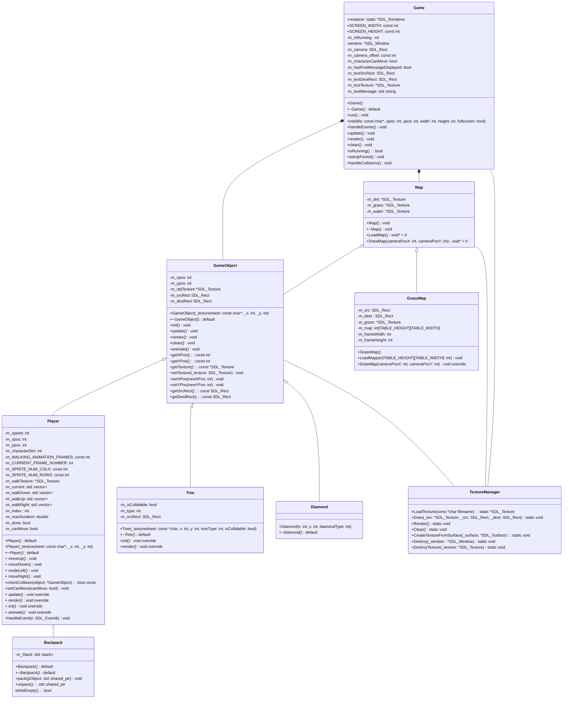

```mermaid
classDiagram
    %% Inheritance
    %%A <|-- B
    
    %% Composition
    %%A *-- C
    
    %% Aggregation
    %%A o-- D

    GameObject <|-- Player
    GameObject <|-- Tree
    GameObject <|-- Diamond

    Player o-- Backpack

    Map <|-- GrassMap

    %% une partie est composée de cartes et de GameObjects
    Game *-- Map
    Game *-- GameObject

    %% la partie utilise TextureManager
    GameObject -- TextureManager
    Map -- TextureManager
    Game -- TextureManager

  

    Map o-- GameObject

    class GameObject {
      +GameObject(_texturesheet: const char*, _x: int, _y: int)
      +~GameObject() default
      +init() void*
      +update() void*
      +render() void*
      +clean() void*
      +animate() void*

      +getXPos(): const int
      +getYPos(): const int

      +getTexture() : const *SDL_Texture*
      +setTexture(_texture: SDL_Texture) void

      +setXPos(newXPos: int) void
      +setYPos(newYPos: int) void

      +getSrcRect(): const SDL_Rect
      +getDestRect(): const SDL_Rect

      -m_xpos: int
      -m_ypos: int

      -m_objTexture *SDL_Texture
      -m_srcRect SDL_Rect
      -m_destRect SDL_Rect


    }


    class Player {
      +Player() default
      +Player(_texturesheet: const char*, _x: int, _y: int)
      +~Player() default*
      + moveUp() void
      + moveDown() void
      + modeLeft() void
      + moveRight() void
      +checkCollision(object: *GameObject) : bool const

      +setCanMove(canMove: bool) void

      + update() void override*
      + render() void override*
      + init() void override*
      + animate() void override*

      +handleEvent(e: SDL_Event&) void
      
      -m_speed: int
      -m_xpos: int
      -m_ypos: int
      -m_characterDim: int

      -m_WALKING_ANIMATION_FRAMES: const int
      -m_CURRENT_FRAME_NUMBER: int

      -m_SPRITE_NUM_COLS: const int
      -m_SPRITE_NUM_ROWS: const int

      -m_walkTexture: *SDL_Texture

      -m_current: std::vector<std::pair<int, int>>
      -m_walkDown: std::vector<std::pair<int, int>>
      -m_walkUp: std::vector<std::pair<int, int>>
      -m_walkRight: std::vector<std::pair<int, int>>
      -m_index : int
      -m_maxDuration: double
      -m_done: bool
      -m_canMove: bool
    
    }
    class Tree {
      +Tree(_texturesheet: const *char, x: int, y: int, treeType: int, isCollidable: bool)
      +~Tree() default*
      +init() void override*
      +render() void override*
      -m_isCollidable: bool
      -m_type: int
      -m_srcRect: SDL_Rect
    
    
    }
    class Diamond {
      +Diamond(x: int, y: int, diamondType: int)
      +~Diamond() default*
    }
    class TextureManager {
      +LoadTexture(const *char filename) : static *SDL_Texture
      +Draw(_tex: *SDL_Texture, _src: SDL_Rect, _dest: SDL_Rect) static void
      +Render() static void
      +Clear() static void
      +CreateTextureFromSurface(_surface: *SDL_Surface): static void
      +Destroy(_window : *SDL_Window) static void
      +DestroyTexture(_texture: *SDL_Texture) static void
    }
    class Game {
      +Game()
      +~Game() default

      +run() void
      +init(title: const char*, xpos: int, ypos: int, width: int, height; int, fullscreen: bool)
      +handleEvents() void
      +update() void
      +render() void
      +clean() void
      +isRunning(): bool
      +setUpForest() void
      +handleCollisions() void

      +renderer: static *SDL_Renderer
      +SCREEN_WIDTH: const int
      +SCREEN_HEIGHT: const int

      -m_isRunning : int
      -window: *SDL_Window
      -m_camera: SDL_Rect
      -m_camera_offset: const int
      -m_characterCanMove: bool
      -m_hasFirstMessageDisplayed: bool
      -m_textSrcRect: SDL_Rect
      -m_textDestRect: SDL_Rect
      -m_textTexture: *SDL_Texture
      -m_textMessage: std::string
      

    }
    class Map {
      +Map() void
      +~Map() void
      +LoadMap() void* = 0
      +DrawMap(cameraPosX: int, cameraPosY: int) void* = 0

      -m_dirt: *SDL_Texture
      -m_grass: *SDL_Texture
      -m_water: *SDL_Texture
    }
    class GrassMap {
      +GrassMap()
      +LoadMap(arr[TABLE_HEIGHT][TABLE_WIDTH]: int) void
      +DrawMap(cameraPosX: int, cameraPosY: int) void override*

      -m_src: SDL_Rect
      -m_dest : SDL_Rect

      -m_grass: *SDL_Texture
      -m_map: int[TABLE_HEIGHT][TABLE_WIDTH]
      -m_frameWidth: int
      -m_frameHeight: int

    }
    class Backpack {
      +Backpack() default
      +~Backpack() default*
      +pack(pObject: std::shared_ptr<GameObject>) void
      +unpack() : std::shared_ptr<GameObject>
      isNotEmpty() : bool
      -m_Stack: std::stack<std::shared_ptr<GameObject>>
    }
    
```